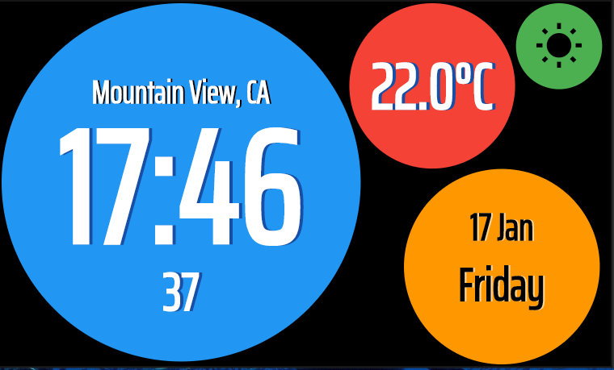
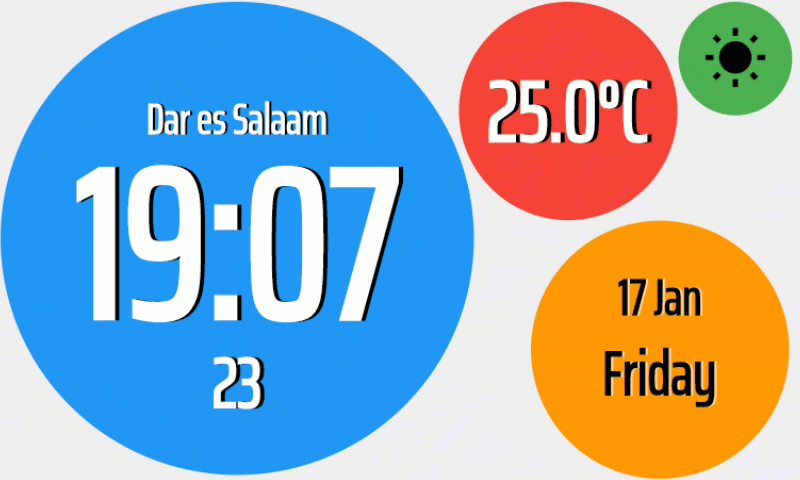

# Colorful Clock

Welcome to the Colorful Clock!

This clock was created as part of the Flutter Clock Challenge as seen here [flutter.dev/clock](https://flutter.dev/clock).

Colorful clock can show Time, Location, Weather Condition, date and day of the week.

It runs better on the devices with aspect ratio of 5:3 in landscape mode even though it can run on any flutter cabable device.

## Modes
Here are the snapshots for the two modes the clock supports:
1. Dark Mode



2. Light Mode


The two mdoes can be demostrated using the gif image below:




## Usage
To run the clock, do the following:

1. Download the [Colorful Clock Github repo](https://flutter.dev/clock) using `git clone`
2. Open the downloaded folder in your IDE
3. Run the following commands inside the Colorful Clock Cloned folder to get it to work
    ```
    flutter channle stable
    flutter upgrade
    cd colorful_clock
    flutter create .
    flutter run
    ```
4. Make sure you have an android or ios emulator running for the clock to execute correctly.


## License

Colorful clock is released under the BSD-3 Clause Licensel that can be found in the BSD-LICENSE file or read it online [here](https://opensource.org/licenses/BSD-3-Clause).
